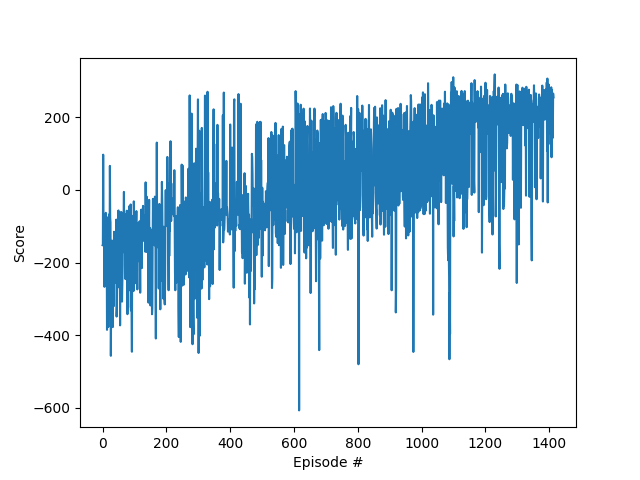
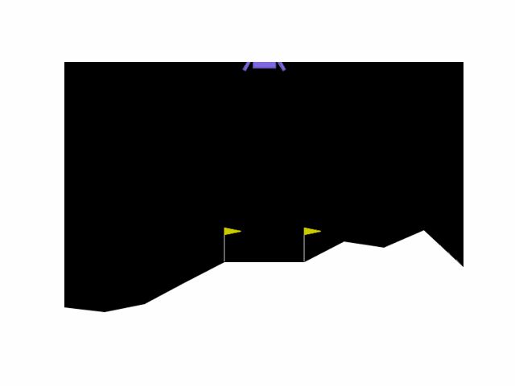

# DQN_Implementation
Implement DQN in GYMNASIUM

### Start
Run the following code to start the training porocess
```
python main.py
```
### Running_Result



The code is based on the following document and paper:
[]: https://gymnasium.farama.org/ "Gymnaxium Document"
[]: https://arxiv.org/abs/1312.5602 "DQN paper"
[]: https://goodboychan.github.io/python/reinforcement_learning/pytorch/udacity/2021/05/07/DQN-LunarLander.html#Define-Replay-Buffer "DQN Implemention"
